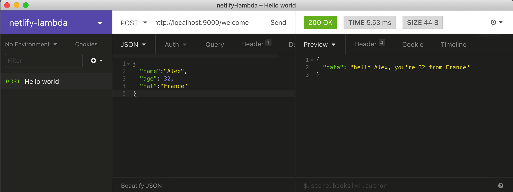

## Netlify Lambda

---

Every thing start with ...

```bash
 npm init
```

then install the npm package [netlify-lambda](https://www.npmjs.com/package/netlify-lambda)

```bash
npm install netlify-lambda
```

To start on dev mode you need to add some sripts on `package.json` file

```json
...
  "scripts": {
    "lambda-serve": "netlify-lambda serve functions",
    "lambda-build": "netlify-lambda build functions"
  },
...
```

- After, create a `netlify.toml` file for the config, on root of the project also.

```bash
 touch netlify.toml
```

and write on it :

```toml
[build]
    functions = "lambda"
```

- Create a folder 📁 `functions` on root of the project

```bash
mkdir functions
```

- Add your js file on it, for exemple.

```bash
touch  functions/welcome.js
```

exemple:

```js
// welcome.js

exports.handler = (event, context, callback) => {
  const { name, age, nat } = JSON.parse(event.body);

  callback(null, {
    statusCode: 200,
    body: JSON.stringify({
      data: `hello ${name}, you're ${age} from ${nat}`
    })
  });
};
```

launch your localhost by running

```bash
npm run lambda-serve
```

Test with Postman on [Insomnia](https://insomnia.rest/)

on `POST` on URI `http://localhost:9000/welcome` like below



Well done in the new univers of function as service (`FASS`).

If you need to push on production, create on your favorite git storage provider but works well with [hub](https://hub.github.com/).

```bash
git add .
git commit -m 'initial commit'
git push origin master
```

Go to your [netlify dashboard](https://app.netlify.com/) and

- Enjoy your lambda
